# RubyStore (Client)

RubyStore is a modern e-commerce web application that delivers a seamless and engaging shopping experience.  
It supports a full range of core features including:

-   **OAuth2 Login** – sign-in quickly with Google
-   **OTP Email Verification** – secure account registration
-   **Product Browsing** – explore a wide range of products
-   **Product Reviewing** - review real-time
-   **Product Details** – images, prices, and descriptions
-   **Wishlist** – add product to wishlist
-   **Shopping Cart** – manage items before checkout
-   **Vouchers** – apply discount codes
-   **Checkout** – complete orders smoothly
-   **Notifications** – real-time order updates
-   **Messaging** – built-in chat system

This repository contains the frontend codebase built with React and other modern technologies.

Check out: [RubyStore (Server)](https://github.com/SoulMinT05/rubystore-backend)

## Example Screenshots

### Desktop View

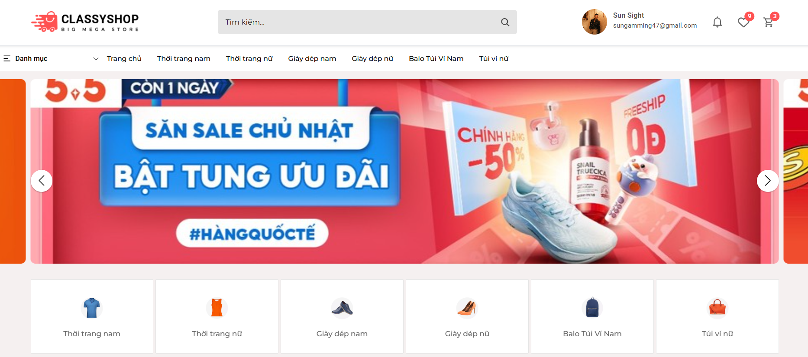

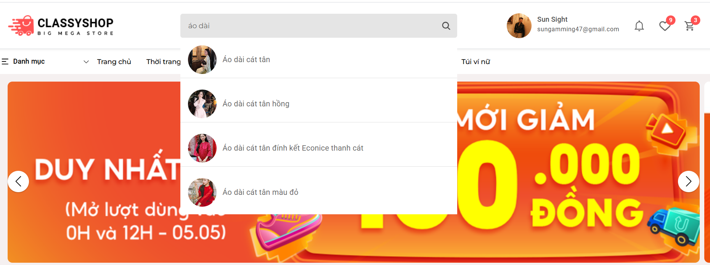

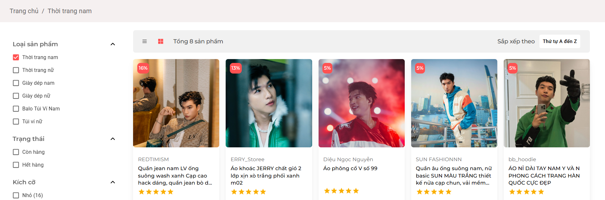

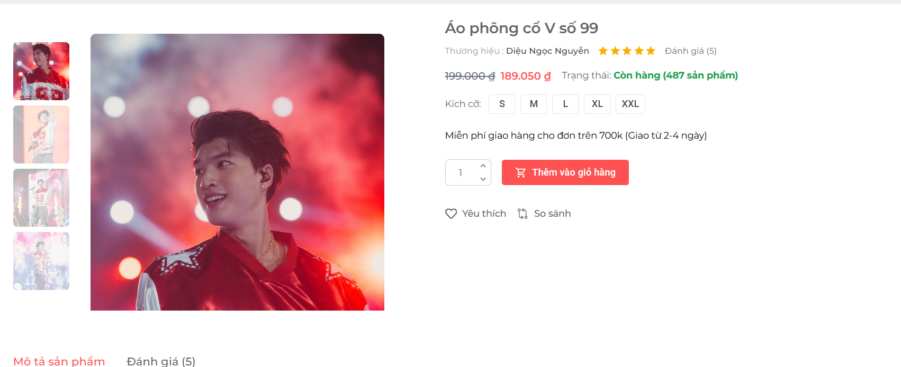

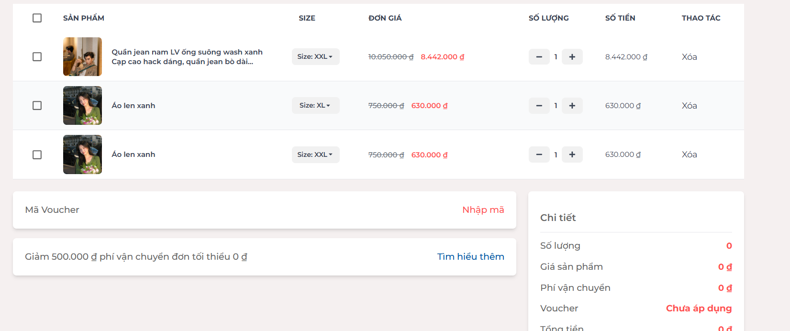

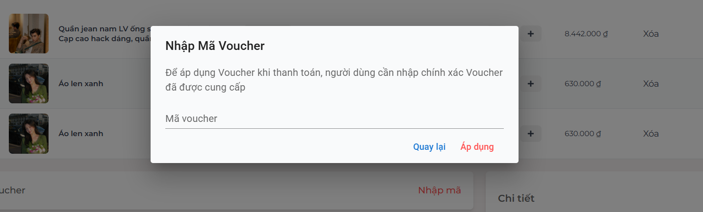

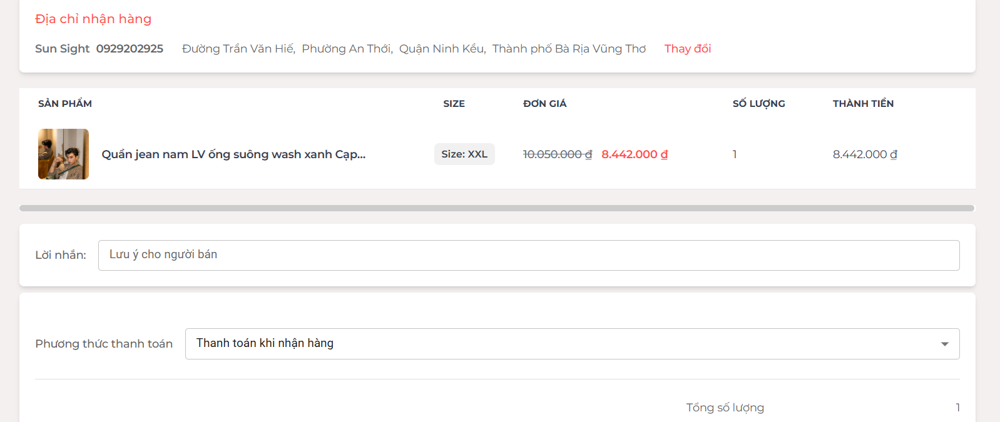


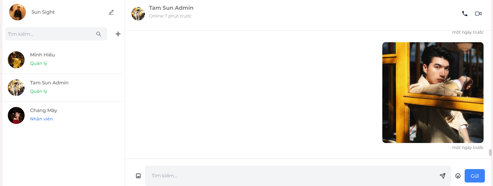

### Mobile View

<p align="center">
  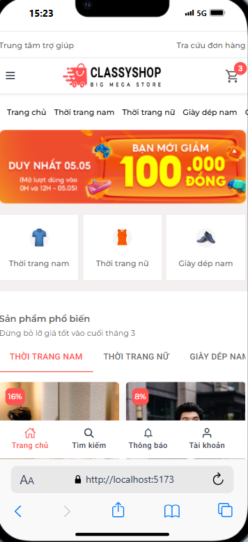
</p>
<p align="center">
  
</p>
<p align="center">
  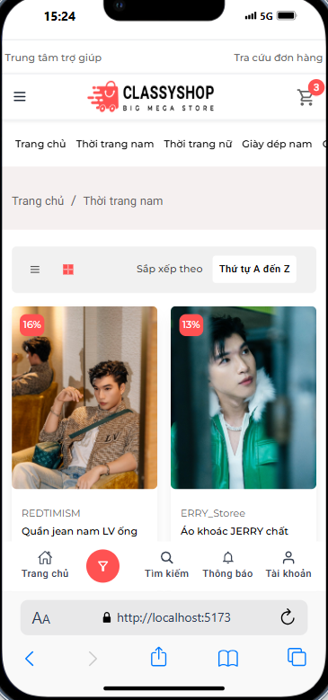
</p>
<p align="center">
  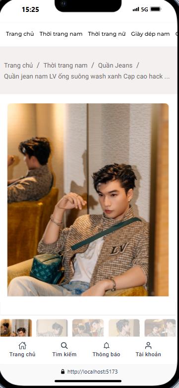
</p>
<p align="center">
  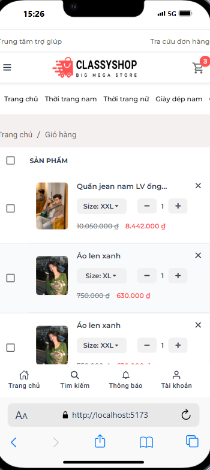
</p>
<p align="center">
  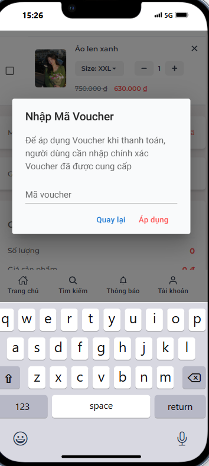
</p>
<p align="center">
  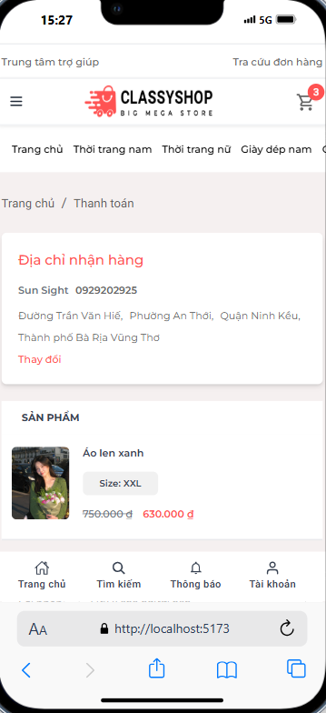
</p>
<p align="center">
  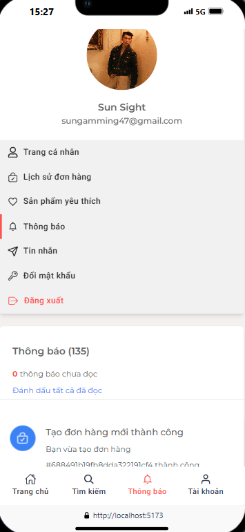
</p>
<p align="center">
  
</p>

## Tech Stack

-   **Library**: ReactJS
-   **UI Library**: Material UI
-   **State Management**: Redux Toolkit
-   **Routing**: React Router DOM
-   **Styling**: TailwindCSS, SCSS, CSS
-   **Utilities**: Axios, JS-Cookies, Firebase, DayJS
-   **Image Viewer**: react-inner-image-zoom, react-image-zoom
-   **Notification**: react-toastify, react-hot-toast
-   **Emoji**: emoji-picker-react

## Getting Started

### Prerequisites

-   Node.js (v22.16 or later recommended)
-   npm or yarn package manager

### Installation

1. Clone the repository:
    ```bash
    git clone https://github.com/SoulMinT05/rubystore-frontend
    ```
2. Install dependencies:
    ```bash
    npm install
    # or
    yarn install
    ```
3. Configure environment variables:

    - Copy `.env.example` to `.env`:
        ```bash
        cp .env.example .env
        ```
    - Ensure the following variables are set in `.env`, and adjust them to match your API endpoints and Cloudinary storage configuration:

        ```env
        VITE_FRONTEND_URL=http://localhost:3000
        VITE_BACKEND_URL=http://localhost:8000
        VITE_API_KEY=api-key
        VITE_AUTH_DOMAIN=auth-domain
        VITE_PROJECT_ID=project-id
        VITE_STORAGE_BUCKET=storage-bucket
        VITE_MESSAGING_SENDER_ID=messaging-sender-id
        VITE_APP_ID=id
        VITE_APP_ID_FACEBOOK=id-facebook
        VITE_APP_SECRET_FACEBOOK=secret-facebook
        ```

### Development Server

Start the development server with:

```bash
npm run dev
# or
yarn dev
```

The app will be available at `http://localhost:5173` by default.

### Build for Production

To build the project for production:

```bash
npm run build
# or
yarn build
```

The production build files will be in the `dist` folder.

## License

This project is licensed under the MIT License. See the [LICENSE](LICENSE) file for details.
